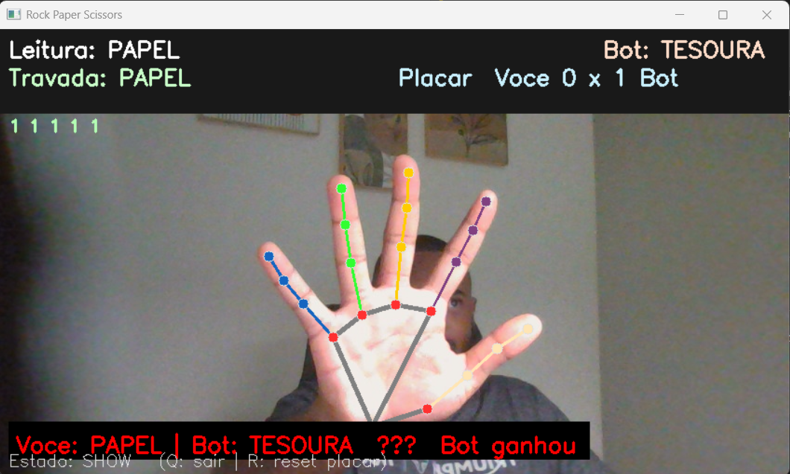

# ✊✋✌️ RPS Vision Game

Um jogo de **Pedra, Papel e Tesoura** controlado por **gestos da mão** usando **Python, OpenCV e MediaPipe**.  
A câmera detecta sua mão, reconhece o gesto (pedra, papel ou tesoura), e o jogo compara contra uma jogada aleatória do bot.  
Inclui placar, countdown, cores para vitória/derrota/empate e efeitos sonoros.

---

## 🚀 Tecnologias utilizadas
- [Python 3.10/3.11](https://www.python.org/) (compatível com MediaPipe)
- [OpenCV](https://opencv.org/) – captura de câmera e visualização
- [MediaPipe Hands](https://developers.google.com/mediapipe) – detecção da mão e landmarks
- [NumPy](https://numpy.org/) – manipulação simples de arrays
- [Pygame](https://www.pygame.org/) – reprodução de sons

---

## 📂 Estrutura do projeto
```
rps-game/
 ├─ main.py        # Jogo completo (bot + placar + som)
 ├─ sounds/
 │   ├─ win.wav                # Som de vitória
 │   ├─ lose.wav               # Som de derrota
 │   └─ draw.wav               # Som de empate
 └─ requirements.txt
```

---

## 🔧 Instalação

1. Clone este repositório:
   ```bash
   git clone https://github.com/rbnascimentoo/rps-vision-game.git
   cd rps-vision-game
   ```

2. Crie um ambiente virtual com Python 3.10 ou 3.11:
   ```bash
   py -3.10 -m venv .venv
   .venv\Scripts\activate     # Windows
   source .venv/bin/activate    # Linux/Mac
   ```

3. Instale as dependências:
   ```bash
   pip install -r requirements.txt
   ```

---

## ▶️ Como jogar

Execute:
```bash
python main.py
```

- Mostre **Pedra**, **Papel** ou **Tesoura** na frente da câmera.  
- O jogo detecta, inicia um **countdown** e compara contra o **bot**.  
- O placar é atualizado e um som toca conforme o resultado:
  - ✅ Vitória: verde + som de vitória
  - ❌ Derrota: vermelho + som de derrota
  - ➖ Empate: amarelo + som neutro
- **Q** → sair do jogo  
- **R** → resetar o placar

---

## 📸 Demonstração



---

## 🧩 Próximos passos
- Modo “**melhor de 5**”.
- Interface gráfica mais rica (menu inicial, botões, etc).

---

## 📄 Licença
Este projeto está sob a licença MIT. Veja o arquivo [LICENSE](LICENSE) para mais detalhes.
